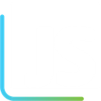

# Curso JStack

📦 Repositório onde deixo os códigos das aulas do curso JStack.

## Sobre o Curso

🗒️ O curso aborda conteúdos sobre a Stack JavaScript como: TypeScript, Node.js, React e React Native. Tudo isso na prática, desenvolvendo projetos reais!

☁️ Além disso, o curso explica como colocar as aplicações no ar ultilizando os serviços da AWS e as lojas de aplicativos do Google (Android) e da Apple (IOS).

🌍 Se quiser saber mais sobre, acesse o site: [https://jstack.com.br/](https://jstack.com.br/)

🔥 Vamos para mais um desafio!!!
